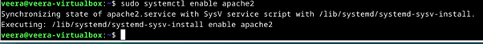
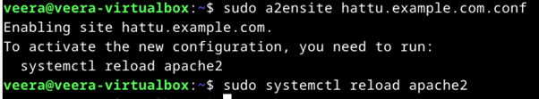

# h1: Oma Linux

Tärkeimmät pääkohdat ranskalaisin viivoin kahdesta eri artikkelista ->

### **Raportin kirjoittaminen** (Karvinen, Tero 2006: Raportin kirjoittaminen. https://terokarvinen.com/2006/raportin-kirjoittaminen-4/)
- Raportin tulee olla toistettavissa (eli raportoi eri vaiheet tarkasti).  
- Huomioi myös laitteisto, sijainti, ja testin ajankohta.  
- Kerro komennot ja toimenpiteet tarkkaan.  
- Mainitse kellonajat ja onnistumisen/epäonnistumisen tulokset.  
- Raportoi odottamattomat virheet ja niiden ratkaisut/ratkaisuyritykset.  
- Käytä väliotsikoita ja huolellista kieltä.  
- Merkitse ylös käyttämäsi lähteet.  
- Älä väitä tehneesi testejä joita et oikeasti ole tehnyt, älä plagioi ja käytä vain kuvia joita on luvallista käyttää.

### Free Software Foundation: FSF Free Software Definition (Free Software Foundation: What is Free Software? https://www.gnu.org/philosophy/free-sw.html#four-freedoms) 
- Free software ei tarkoita ilmaissoftaa (vaikka sekin on mahdollista), vaan oikeutta käyttää ohjelmia vapaasti.
- Jos softan käytössä täyttyy neljä ennaltamäärättyä vapautta, softa luetaan free softwareksi. Neljä vapautta ovat seuraavat:
  - Freedom 0: Vapaus 0 on vapaus suorittaa ohjelma kuten itse haluaa.
  - Freedom 1: Vapaus 1 on vapaus tutkia miten ohjelma toimii, ja muuttaa sitä sopimaan siihen tarkoitukseen mihin itse sitä tarvitsee. Tätä kohtaa varten lähdekoodin saatavuus on ensisijaisen tärkeää. Ohjelmien muokkaukseen siis kannustetaan.
  - Freedom 2: Vapaus 2 on vapaus jakaa kopioita ohjelmasta muille. Ohjelmien levitys nähdään siis positiivisena asiana.
  - Freedom 3: Vapaus 3 on vapaus jakaa ja levittää myös niitä versioita ohjelmasta, joita on itse muuttanut ja muokannut. Muutkin siis hyötyvät yksilön luovuudesta ja innovoinnista.

### Linuxin asennus virtuaalikoneeseen

Koneeni isäntäjärjestelmä on Windows 11. Koneeni on itse koottu PC, speksit ovat:
Prosessori (CPU): 13th Gen Intel Core i5-13400F @ 2.5 GHz.
Muisti (RAM): 16,0 GB.
Tallennustila: Samsung SSD 980, 1 TB.
Näytönohjain (GPU): NVIDIA GeForce RTX 3060 Ti.

- **Virtuaalikoneen asennuksen vaiheet**:

  Pohjana Tero Karvinen 2024: Install Debian on Virtualbox, https://terokarvinen.com/2021/install-debian-on-virtualbox/
  
  
  
  1. Latasin Debianin sivulta levykuvan, valitsin version debian-live-12.9.0-amd64-xfce.iso
     
  

  2. Vein levykuvan VirtualBoxiin, joka minulla oli jo ennestään asennettuna. Klikkasin itseni Expert Modeen, jolloin enemmän asetuksia tulee näkyviin. Ruksitin “Skip Unattended Installation” ja valitsin versioksi Debian (64-bit).
     
  
  
  3. Hardware-välilehdeltä muutin muistin määräksi 4000 MB.
  
  

  4. Hard Disk -välilehdeltä muutin levytilaksi 60 GB.

  

  5. Testasin virtuaalikoneen toimintaa kirjoittamalla selaimen osoitekenttään satunnaisen nettisivun. Toimii!
  
  6. Sitten klikkasin itseni työpöydän Installeriin ja muutin esimerkiksi keyboard layoutin suomenkieliseksi. Lisäksi nimesin itseni ja koneeni. Valitsin tietysti erittäin vahvan salasanan.
     
  

     
  7. Seuraavaksi päivittelin kaiken tarpeellisen käyttämällä seuraavia komentoja:
     $ sudo apt-get update (
     $ sudo apt-get -y dist-upgrade (kaikkien ohjelmistojen päivitys)
     $ sudo apt-get -y install ufw (palomuuri)
     $ sudo ufw enable (palomuuri käyttöön)
     
  8. Sitten päätin vielä asentaa tekstieditorin, eli Vimin. Käytin seuraavaa komentoa:
     $ sudo apt install vim
     
 

 Ja asennus toimi! Pääsin luomaan "hienotiedosto"-nimisen tiedoston ja kirjoittamaan siihen komennolla:
    $ vim hienotiedosto
    
    

