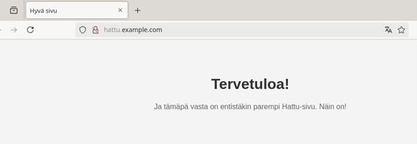
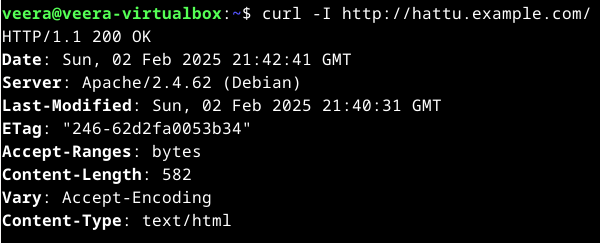
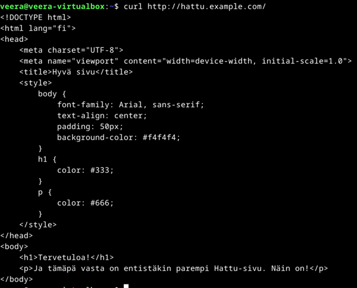

### x) 
### Muutama muistiinpano Name-based Virtual Host Support -artikkelista (https://httpd.apache.org/docs/2.4/vhosts/name-based.html):

- Name-based virtual hosting allows multiple hosts to share the same IP address by using the hostname from the HTTP headers
- Name-based virtual host resolution first uses IP-based matching to find the best host, then compares ‘ServerName’ and ‘ServerAlias’ directives to select the correct virtual host 
- Always specify a ServerName in each virtual host to avoid unintended inheritance.
- Use ServerAlias to allow multiple names for the same host

### Muutama muistiinpano Tero Karvisen artikkelista [Name Based Virtual Hosts on Apache – Multiple Websites to Single IP Address](https://terokarvinen.com/2018/04/10/name-based-virtual-hosts-on-apache-multiple-websites-to-single-ip-address/):

- Apache allows hosting multiple websites on a single IP address using name-based virtual hosts. Each domain is mapped to the same IP.
- To add a new virtual host 1. create a configuration file with ‘ServerName’, ‘ServerAlias’, and ‘DocumentRoot’, 2. enable it, 3. restart Apache.
- You can test locally by modifying `/etc/hosts` to simulate domain names and access the sites using a browser.

### a)	Apachen asennus

Asensin Apachen komennolla `sudo apt install apache2 -y`. Seuraavaksi tarkistin toimiiko Apache, komennolla `sudo systemctl enable apache2`

 

Ja curl-komennon avulla tarkistin, vastaako webpalvelin localhostiin. Eli komento `curl -I http://localhost`. Vastaukseksi tuli 200 OK eli toimii!

 

---

### b)	Lokien rivit ja niiden analysointi

Seuraavaksi latasin palvelimeltani yhden sivun, ja tarkastelin syntyneen lokin rivejä. 

 

Lokit noudattavat yleistä lokiformaattia, englanniksi Combined Log Format (Log Files - Apache HTTP Server Version 2.4) Lokiriveillä on siis sama muoto, eli:
IP address - Username - Timestamp - "HTTP request" HTTP status code Content length "Referer" "User-agent"

### 1. rivi

`127.0.0.1 - - [02/Feb/2025:15:37:15 +0200] "GET / HTTP/1.1" 200 3380 "-" "Mozilla/5.0 (X11; Linux x86_64; rv:128.0) Gecko/20100101 Firefox/128.0"`

Tässä lokirivissä näkyy, että avasin pääsivun.

• 127.0.0.1 = Pyyntö tuli localhostista.

• - - = Ei autentikaatiota (käyttäjätunnusta).

• [02/Feb/2025:15:37:15 +0200] = Aikaleima.

• "GET / HTTP/1.1" = HTTP-pyyntö:

      GET = Haetaan pääsivu (/).
      
      HTTP/1.1 = HTTP-protokollan versio.
  
• 200 = HTTP-vastauskoodi (OK, onnistunut pyyntö).

• 3380 = Vastauksen koko (3380 tavua).

• "-" = Ei refereriä (ei tultu toiselta sivulta).

• "Mozilla/5.0 (X11; Linux x86_64; rv:128.0) Gecko/20100101 Firefox/128.0" = Käyttäjäagentti

      Mozilla/5.0 = Standardisoitu selaintunniste.
      
      X11; Linux x86_64 = Käyttöjärjestelmä on Linux (64-bittinen).
      
      Firefox/128.0 = Selain on Firefox 128.

### 2. rivi

`127.0.0.1 - - [02/Feb/2025:15:37:15 +0200] "GET /icons/openlogo-75.png HTTP/1.1" 200 6040 "http://localhost/" "Mozilla/5.0 (X11; Linux x86_64; rv:128.0) Gecko/20100101 Firefox/128.0"`

Tällä rivillä ladataan kuva, joka on Apachen sivulla. Tässä tapauksessa se on logo. 

• 127.0.0.1 = Pyyntö tuli localhostista.

• - - = Ei autentikaatiota (käyttäjätunnusta).

• [02/Feb/2025:15:37:15 +0200] = Aikaleima.

• GET /icons/openlogo-75.png = Selain haki kuvatiedoston /icons/openlogo-75.png.

• 200 = Pyyntö onnistui.

• 6040 = Vastauksen koko on 6040 tavua.

• "http://localhost/" = Referer, kuva haettiin pääsivulta.

• "Mozilla/5.0 (X11; Linux x86_64; rv:128.0) Gecko/20100101 Firefox/128.0" = Sama selain kuin aiemmin.

### 3. rivi

`127.0.0.1 - - [02/Feb/2025:15:37:15 +0200] "GET /favicon.ico HTTP/1.1" 404 487 "http://localhost/" "Mozilla/5.0 (X11; Linux x86_64; rv:128.0) Gecko/20100101 Firefox/128.0"`

Tässä rivillä selain yrittää etsiä faviconin, muttei löydä sitä ja palauttaa siksi 404. 

• 127.0.0.1 = Pyyntö tuli localhostista.

• - - = Ei autentikaatiota (käyttäjätunnusta).

• [02/Feb/2025:15:37:15 +0200] = Aikaleima.

• GET /favicon.ico = Selain yritti hakea favicon.ico-tiedoston.

• 404 = Tiedostoa ei löytynyt.

• 487 = 487 tavun kokoinen virhesivu palautettiin.

• "http://localhost/" = Referer, tämä pyyntö lähetettiin pääsivulta.

• "Mozilla/5.0 (X11; Linux x86_64; rv:128.0) Gecko/20100101 Firefox/128.0" = Sama selain.

### 4. rivi

`127.0.0.1 - - [02/Feb/2025:15:38:14 +0200] "HEAD / HTTP/1.1" 200 255 "-" "curl/7.88.1"`

Tällä rivillä näkyy, että tein testipyynnön käyttämällä curl-komentoa.

• 127.0.0.1 = Pyyntö tuli localhostista.

• - - = Ei autentikaatiota (käyttäjätunnusta).

• [02/Feb/2025:15:37:15 +0200] = Aikaleima.

• HEAD / = HEAD-pyyntö (vain HTTP-otsikot, ilman sisältöä).

• 200 = Pyyntö onnistui.

• 255 = 255 tavua palautettiin.

• "-" = No referer (ei tultu toiselta sivulta).

• "curl/7.88.1" = Käyttäjäagentti on curl, eli tämä pyyntö tehtiin komentoriviltä.

---

### c) Etusivu uusiksi

Seuraavaksi loin hakemiston, johon normaali käyttäjä voi kirjoittaa.

 

Sitten tein uuden etusivun testisivulle.

 

Loin uuden vhost-tiedoston, joka määrittää mistä hakemistosta hattu.example.com ladataan.

 

Sitten poistin vanhan oletussivun ja otin uuden, vasta luomani sivun käyttöön. Latasin Apachen uudelleen aktivoidakseni uuden konfiguraation.

 

Lisäsin hattu.example.comin hosts-tiedostoon, jotta se toimisi localhostissa.

 

Sitten olikin aika testata toimisiko sivu. Menin selaimella osoitteeseen http://hattu.example.com

 

Ja siellähän se on, vaikkakin ääkköset puuttuvat.

---

### e) HTML5-sivu

Tehdäkseni sivusta hieman tyylikkäämmän, kävin kirjoittamassa tiedostosta HTML5-version. Seuraavassa tehtävässä näkyy kuva koodista.

 

---

### f) Curl ja curl -I

Esimerkkejä curl-komennoista: 

 
 

