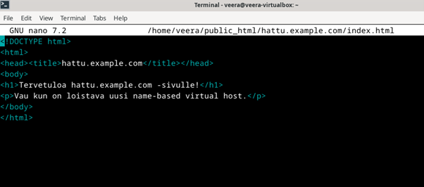

### a)	Apachen asennus

Asensin Apachen komennolla `sudo apt install apache2 -y`. Seuraavaksi tarkistin toimiiko Apache, komennolla `sudo systemctl enable apache2`

 

Ja curl-komennon avulla tarkistin, vastaako webpalvelin localhostiin. Eli komento `curl -I http://localhost`. Vastaukseksi tuli 200 OK eli toimii!

 

b)	Lokien rivit ja niiden analysointi
Seuraavaksi latasin palvelimeltani yhden sivun, ja tarkastelin syntyneen lokin rivejä. 

 

Analyysi

 

 

 

 

 

 

