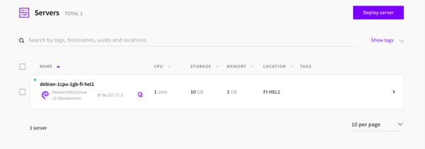
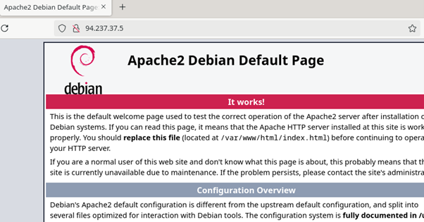

## h4) Maailma Kuulee

### x) 
Muutama tiivistetty kohta Susanna Lehdon artikkelista [Teoriasta käytäntöön pilvipalvelimen avulla (h4)](https://susannalehto.fi/2022/teoriasta-kaytantoon-pilvipalvelimen-avulla-h4/):

- Autentikointiin voi valita salasanan, mutta SSH-avaimia suositellaan.

- Palvelin suojataan palomuurilla, ja verkkosivujen toimintaa varten HTTP ja HTTPS-liikenne tulee avata.

- Muut portit kannattaa sulkea tietoturvan takaamiseksi.

- Tietoturvan kannalta myös ohjelmistojen päivitykset tulisi tehdä säännöllisesti.

  
Muutama tiivistetty kohta Tero Karvisen artikkelista [First Steps on a New Virtual Private Server – an Example on DigitalOcean and Ubuntu 16.04 LTS](https://terokarvinen.com/2017/first-steps-on-a-new-virtual-private-server-an-example-on-digitalocean/):

- Luo uusi virtuaalipalvelin DigitalOceanissa ja valitse Ubuntu 16.04 LTS.

- Ota käyttöön palomuuri sallimalla ensin SSH-yhteydet.

- Luo uusi käyttäjä ja anna sille sudo-oikeudet, sitten poista root-kirjautuminen.

- Päivitä järjestelmän ohjelmistot uusimpiin versioihin.
  
- Konfiguroi julkinen DNS-nimi NameCheapissa, jotta se ohjautuu palvelimelle.
  

### a) 

Vuokrasin pilvipalvelimen [UpCloud](https://upcloud.com/) -sivustolta. Halusin palvelimen Suomesta, ja UpCloud on suomalainen palveluntarjoaja. 

Ensin valitaan serverin maa, valitsin tosiaan Suomen.

Sitten valitaan muistin ja tallennustilan määrä. Valitsin halvimman vaihtoehdon.

Storage-kohtaan en tehnyt muutoksia.

OS-kohdassa valitsin saman käyttöjärjestelmän kuin virtuaalikoneessani, eli Debian Bookwormin.

Networkissa tarkistin vain että sekä IPv4 että IPv6 on valittuina.

Tein SSH-avaimen palvelimelle salasanan sijaan.

Deploy server ja palvelin on päällä!

### b) / c)

Menin SSH ja rootin kautta serverin IP:lle. 

 
Asensin palomuurin käyttämällä komentoa sudo apt update && sudo apt install ufw -y

 
Sitten reikä SSH:lle, jonka jälkeen enabloin palomuurin.

 
Palomuuri päällä.

Olinkin jo jäsen osassa ryhmiä. Lisäsin itseni adm-ryhmään. 

Lukitsin rootin.

 
Sitten päivitin ohjelmat komennolla sudo apt upgrade.

 
Tarkistin vielä mitkä portit olikaan sallittu. 

Nyt palvelimen IP johdattaa meidät Apachen testisivulle.

Tein vaatimattoman uuden testisivun ja uudelleenkäynnistin Apachen. 

Ja sehän toimii!

### Lähteet:

Susanna Lehdon artikkeli [Teoriasta käytäntöön pilvipalvelimen avulla (h4)](https://susannalehto.fi/2022/teoriasta-kaytantoon-pilvipalvelimen-avulla-h4/)
Tero Karvisen artikkeli [First Steps on a New Virtual Private Server – an Example on DigitalOcean and Ubuntu 16.04 LTS](https://terokarvinen.com/2017/first-steps-on-a-new-virtual-private-server-an-example-on-digitalocean/)
Tero Karvisen [kotitehtävävinkit](https://terokarvinen.com/linux-palvelimet/#h4-maailma-kuulee) h4-tehtävän alla
