# h5 Nimekäs

### Domainin ohjaaminen

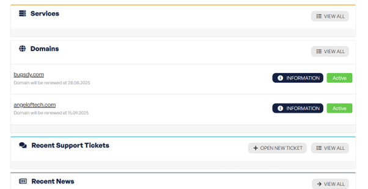
 
Minulla on muutama domain jo hallussa aikaisempien projektieni ansiosta. En kuitenkaan ole tehnyt niillä vielä mitään. Domainhotellin DNS-hallinta on maksullinen palvelu, päätin siis vaihtaa Cloudflareen, joka tarjoaa sen ilmaiseksi.
Cloudflare skannaa DNS-tietueet automaattisesti, mutta ei tietenkään löytänyt domainistani vielä mitään. Minun piti siis lisätä ne manuaalisesti Cloudflareen.

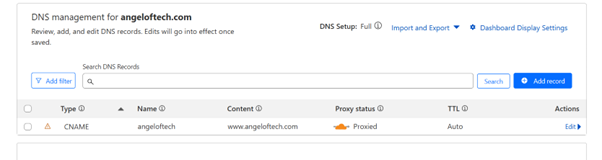
 
Menin DNS management -sivulle, jonne syötin uudet CNAME-tiedot. CNAME ohjaa automaattisesti päädomainin osoitteeseen ilman, että minun tarvitsee päivittää IP:tä erikseen.

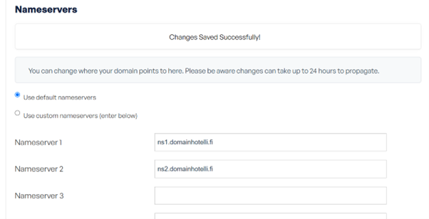

Sitten palasin Domainhotelliin vaihtamaan nameserverit Cloudflaren antamiin nameservereihin. Muutoksilla saattaa kestää kauankin ennen kuin ne tulevat näkyviin. Pysyin siis kärsivällisenä. 
Seuraavat tehtävät teen kunnolla loppuun, kunhan DNS päivittyy. Mutta teen sen minkä pystyn nyt.

---

### Based
Loin directoryn sivulleni komennolla mkdir /home/veera/angeloftech.com

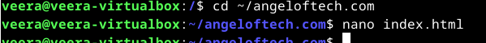

Loin directoryyn index.html-sivun, jonne copy pastesin vanhan kotisivuni koodin. 
Seuraavaksi varmistin, että Apache-konfiguraatio on asetettu niin, että se osoittaa kotisivukansioon, jossa index.html-tiedosto sijaitsee.  

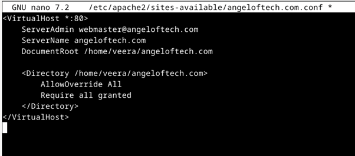
 
Avasin Apache-konfiguraatiotiedosto ja lisäsin kuvan mukaisen konfiguraation. 

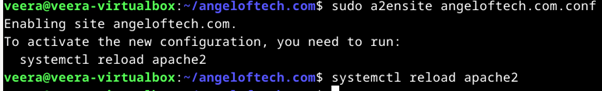
 
Aktivoin uuden sivuston ja käynnistin Apachen uudelleen järjestelmän ohjeiden mukaisesti (Apachen olisi siis voinut käynnistää ennen sivun aktivointia). 

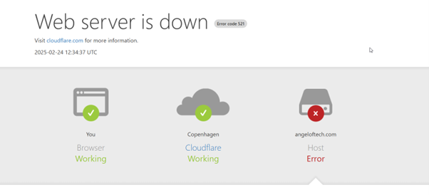
 
Menemällä sivulleni, tulee ainakin jotain näkyviin. Tämä on jo positiivinen asia. Odottelen siis, että DNS-tietueet päivittyvät, ja kokeilen uudestaan.

---

### Kotisivujen tekeminen
Sitten tein kansion kotisivujeni kolmelle html-sivulle komennolla sudo mkdir -p /var/www/angeloftech.com/public_html
Loin oman käyttäjäni omistaman kansio (ei pääkäyttäjän oikeuksia) komennolla sudo chown -R veera:veera /var/www/angeloftech.com/public_html
Sitten menin GitHub-repositoriooni ja latasin kaikki kotisivuni tiedostot ZIP-tiedostona. 

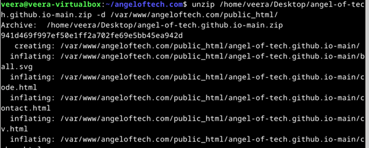
 
Purin tiedostot epähuomiossa omaan alikansioonsa, noudin ne sieltä komennolla sudo mv /var/www/angeloftech.com/public_html/angel-of-tech.github.io-main/* /var/www/angeloftech.com/public_html/
(Jatkan tätä kunhan pystyn varmistamaan että kaikki näkyy sivulla kuten pitää)

---

### Alidomainit

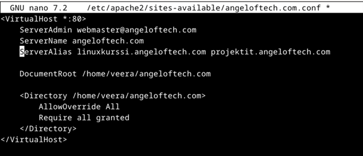
 
Lisäsin alidomainit muokkaamalla conf-tiedostoa ja laittamalla alidomainit serverin aliaksiksi. 

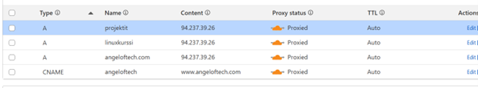
 
Sitten kävin lisäämässä alidomainit Cloudflareen. Nyt alidomainit tosiaan osoittavat samalle sivulle kuin angeloftech.com. Testaan toimivatko alidomainit sitten kun DNS-tietueet ovat toiminnassa.

---

### Host- ja dig-komentojen käyttö

1. Huomasin heti, ettei host-komentoa löydy. Asensin sen siis ensitöikseni, sekä päivitin ohjelmistot. 
sudo apt update
sudo apt install dnsutils

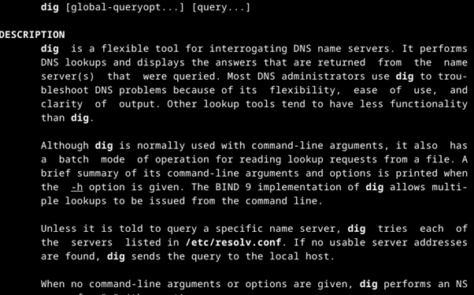
 
Nyt manuaalista löytyy sekä host että dig. Tutkin dig-komentoa tarkemmin. 
Suorittaessani komennon host angeloftech.com mitään ei tapahdu.

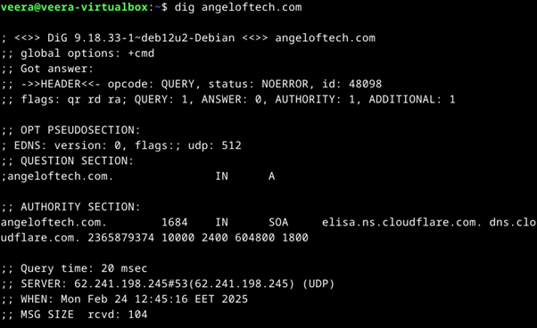
 
Dig angeloftech.com tuottaa kuitenkin enemmän tulosta. Tuloksesta näkee, että domain on olemassa, mutta se ei vielä osoita minnekään (ANSWER: 0). Tämä toivottavasti korjaantuu pian kunhan DNS-tietue päivittyy.

2. host terokarvinen.com

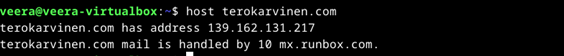
 
Vastaus antaa sivun IP:n ja sähköpostipalvelimen.
dig terokarvinen.com

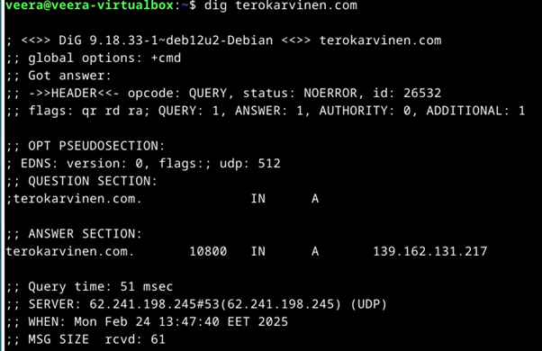
 
Vastauksesta ilmenee ainakin seuraavat tärkeät seikat:
terokarvinen.com. 10800 IN A 139.162.131.217 kertoo, että terokarvinen.com on liitetty IP-osoitteeseen 139.162.131.217.
Query time: 51 msec kertoo, että kyselyn saaminen kesti 51 millisekuntia.
3. host google.com

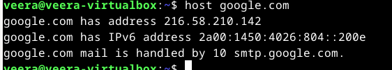
 
Ja dig google.com

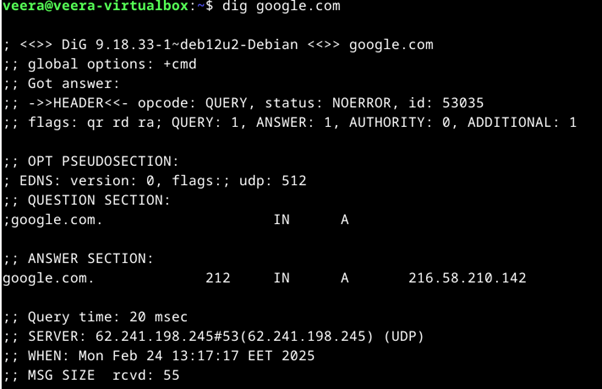
 
Vastauksesta ilmenee muun muassa seuraavat asiat:
google.com. 212 IN A 216.58.210.142 kertoo, että google.com-verkkotunnus on liitetty IP-osoitteeseen 216.58.210.142.
Query time: 20 msec kertoo, että DNS-kysely suoritettiin onnistuneesti ja nopeasti 20 millisekunnissa.

---

**Lähteet:

Tero Karvisen kotitehtävävinkit h5-tehtävän alla
