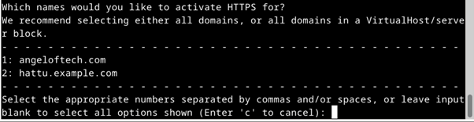
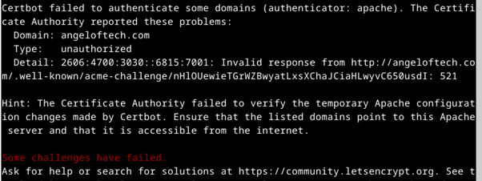

## x) Tiivistelmät

Pikainen tiivistys Let's Encryptin [How It Works](https://letsencrypt.org/how-it-works/)-artikkelista:
- Let's Encrypt enables automatic issuance and management of HTTPS server certificates.
- The agent must prove they have control over the domain using either DNS records or an HTTP resource.
- Requesting, renewing, and revoking certificates is done using an authorized key pair.

Pikainen tiivistys Lange 2024: Lego: Obtain a Certificate:[Using an existing, running web server]https://go-acme.github.io/lego/usage/cli/obtain-a-certificate/index.html#using-an-existing-running-web-server) -artikkelista:
- If a web server is already running on port 80, the `--http` option requires `--http.webroot`
- The `--http.webroot` option specifies the directory where Lego writes the http-01 challenge token to the `.well-known/acme-challenge` folder.
- Ensure the specified webroot directory is publicly accessible as the root directory (`/`) for validation purposes.
- Execute the Lego command with `--accept-tos`, `--email`, `--http`, `--http.webroot`, and `--domains` options to obtain certificates.

Pikainen tiivistys The Apache Software Foundationin artikkelista [Apache HTTP Server Version 2.4 [Official] Documentation: SSL/TLS Strong Encryption: How-To: [Basic Configuration Example](https://httpd.apache.org/docs/2.4/ssl/ssl_howto.html#configexample)](https://httpd.apache.org/docs/2.4/ssl/ssl_howto.html#configexample):
- Load the SSL module
- Enable listening on port 443
- Define a virtual host for HTTPS

## a) Let's

Ensin suoritin komennon sudo apt update && sudo apt install certbot python3-certbot-apache, jolla siis asensin certbotin. Certbot on Let’s Encryptin virallinen asiakasohjelma. 

Sitten hankin ja asensin sertifikaatin komennolla sudo certbot --apache. Seurasin ruudulle ilmestyviä ohjeita. Syötin oman sähköpostiosoitteeni (tässä kohtaa kannattaa olla kärsivällinen, luulin ensin että komentorivi jumittui, mutta sillä kestikin vain aikansa kunnes vastasi) ja valitsin sen domainin, jolle halusin sertifikaatin, eli angeloftech.com.

No sittenpä tulikin vastaan ongelma, nimittäin sen minkä taakseen jättää, sen edestään eittämättä löytää. En siis ollut viime viikolla saanut domainia toimintaan, joten eihän sertifikaatin asennus tietenkään onnistunut. Huoh! No pakkohan tämä on hoitaa kuntoon. 
